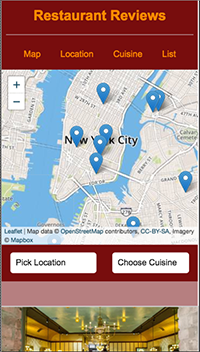
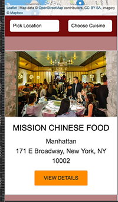
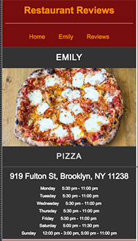
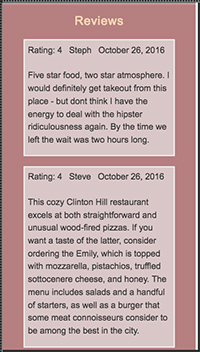
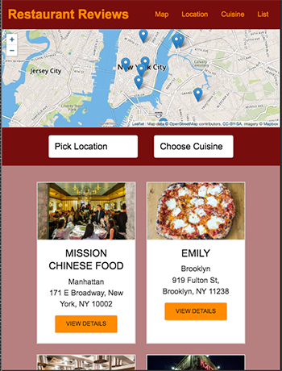
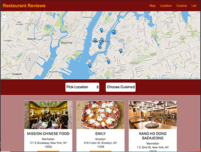
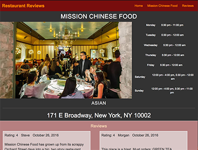

# Restaurant Reviews App
##### Project for the *Front-End Web Developer Nanodegree*

#### Introduction

**Title**: Restaurant Reviews

by Rebecca Hanlon

*Restaurant Reviews* is an app that allows the user to look up restaurants in a selected neighborhood and read the reviews for that restaurant.  The user chooses the neighborhood and the type of food.  After the selected restaurants appear, the user can select a restaurant to read its reviews.  A map is provided to see where restaurants are located.

Click [here](#picture-of-responsive-design-website) to see pictures of the website's Responsive Design.

<hr>

##### Start-up Server

To start up a simple HTTP server to serve up the site files on your local computer use the Python simple server. Python is usually already installed on most computers.

In a terminal, check the version of Python you have: ```python -V```. Use the following commands based on your version of python:
- Use port 8090 or another port if already in use
- Python 2.x, ```python -m SimpleHTTPServer 8090```
- Python 3.x, ```python3 -m http.server 8090```
- Click the link in the terminal: ```http://localhost:8090```
- If you don't have Python installed, navigate to Python's website to download and install the software.

##### Technical Components
- CSS Grid, Flexbox and Media Queries used to build the _responsive features_.
- Aria roles, global attributes and semantic html used to enhance Accessibility.
- JavaScript (ECMASript 6)

- Leaflets.js, an open-source JavaScript library for mobile-friendly interactive maps. [Leaflets.js](https://leafletjs.com/)
- Mapbox API for the map. [Mapbox](https://www.mapbox.com/)
- Service Worker API, for offline usability. [Service Worker API](https://developer.mozilla.org/en-US/docs/Web/API/Service_Worker_API)

##### Articles and Tutorials
**notes**:

Used the following tutorials, articles and docs while building this app.

- Project 1 MWS Webinar with Doug Brown [video](https://www.youtube.com/watch?v=92dtrNU1GQc).
This video helped me get familiar with the different files and develop an overall plan to improve the responsive design, responsive images and accessibility.

- Tutorial Request: FEND Project 5 - Service Workers [video](https://www.youtube.com/watch?v=2PY733qFR3A&feature=youtu.be).
This video gave a nice review of Service Worker without a lot of additional files.

- *Images*,  by Pete LePage at Web Fundamentals [article](https://developers.google.com/web/fundamentals/design-and-ux/responsive/images).
This video was very clear and simple for a simple app.  It demonstrated .clone() which catches the response for caching.

- *Service Worker demo*, at MDN web docs [tutorial](https://developer.mozilla.org/en-US/docs/Web/API/Service_Worker_API/Using_Service_Workers#Service_workers_demo).
This had useful code samples.  Also showed the .clone() snippet for caching the response.
Explored the 'see also' links:  *Understanding Service Workers*, *The service Worker Cookbook*, *Service Workers 101 cheatsheet*

- Lesson 13: Introducing the Service Worker, Front-End Applications in the FEND course.  Used the lesson as a foundation for SW then expanded with the .clone() function.

- *Intro to Service Worker & Caching*,  by Traversy Meida [video](https://www.youtube.com/watch?v=ksXwaWHCW6k&feature=youtu.be)
Used this to review and implement ```scrset``` feature for the pictures.

- MDN web docs
    - [aria-label attribute](https://developer.mozilla.org/en-US/docs/Web/Accessibility/ARIA/ARIA_Techniques/Using_the_aria-label_attribute)
    - [aria-labelledby attribute](https://developer.mozilla.org/en-US/docs/Web/Accessibility/ARIA/ARIA_Techniques/Using_the_aria-labelledby_attribute)
    - [Service Worker API](https://developer.mozilla.org/en-US/docs/Web/API/Service_Worker_API)


#### Pictures of Responsive Design of App
##### Phone









##### Tablet



##### Desk Top



